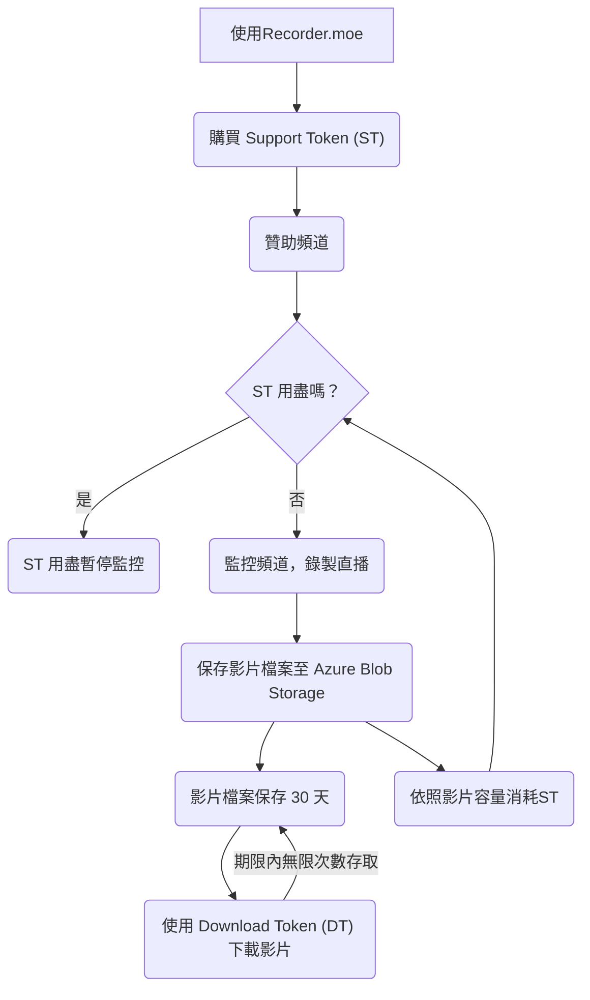

# Use case diagram

```mermaid
graph TD;
    C[使用Recorder.moe];
    C --> D("購買 Support Token (ST)");
    D --> E(贊助頻道);
    F --> |是| J(ST 用盡暫停監控);
    E --> F{"ST 用盡嗎？"};
    F --> |否| G("監控頻道，錄製直播");
  
    G --> H(保存影片檔案至 Azure Blob Storage);
    H --> K(影片檔案保存 30 天);
    K --> L("使用 Download Token (DT) 下載影片");
    L --> |期限內無限次數存取|K;
    H --> M(依照影片容量消耗ST) --> F
```
