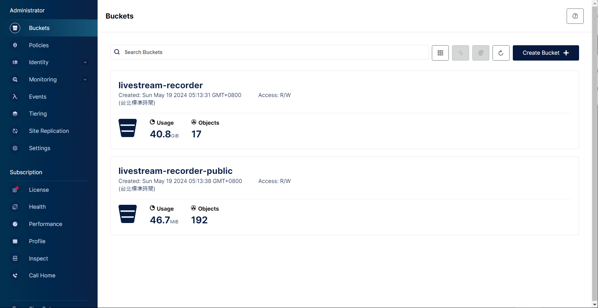
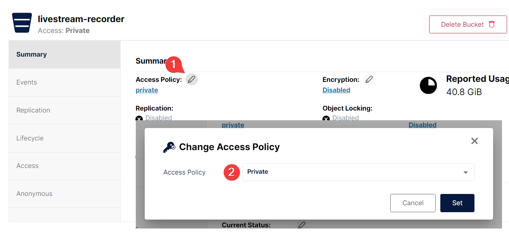
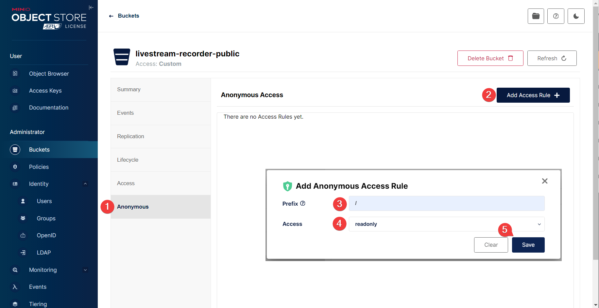
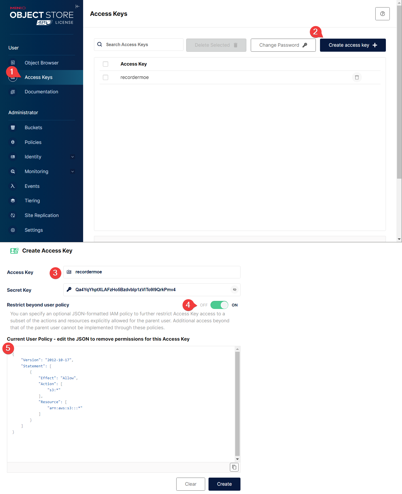
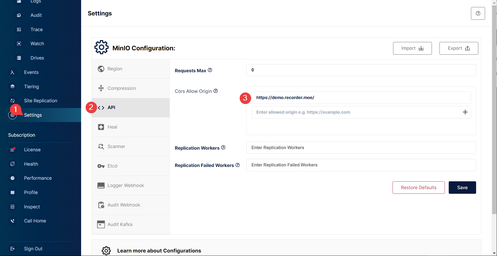

# S3







## Policy 'readwrite'

```json
{
    "Version": "2012-10-17",
    "Statement": [
        {
            "Effect": "Allow",
            "Action": [
                "s3:*"
            ],
            "Resource": [
                "arn:aws:s3:::*"
            ]
        }
    ]
}
```
