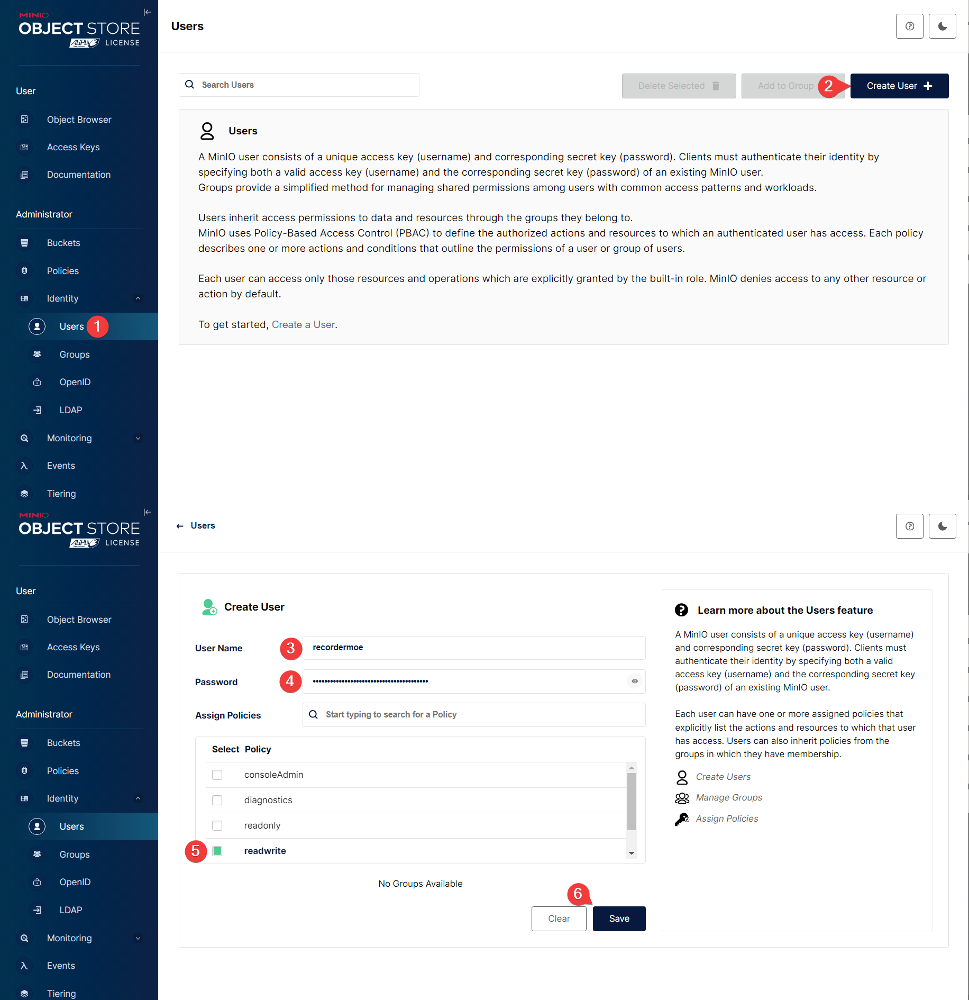

# S3





## Policy for public bucket

Remember to replace `livestream-recorder-public` with your bucket name.

```json
{
    "Version": "2012-10-17",
    "Statement": [
        {
            "Effect": "Allow",
            "Principal": {
                "AWS": [
                    "*"
                ]
            },
            "Action": [
                "s3:GetBucketLocation",
                "s3:ListBucket"
            ],
            "Resource": [
                "arn:aws:s3:::livestream-recorder-public"
            ]
        },
        {
            "Effect": "Allow",
            "Principal": {
                "AWS": [
                    "*"
                ]
            },
            "Action": [
                "s3:GetObject"
            ],
            "Resource": [
                "arn:aws:s3:::livestream-recorder-public/*"
            ]
        }
    ]
}
```

## Policy for Access Key

```json
{
    "Version": "2012-10-17",
    "Statement": [
        {
            "Effect": "Allow",
            "Action": [
                "s3:*"
            ],
            "Resource": [
                "arn:aws:s3:::*"
            ]
        }
    ]
}
```
