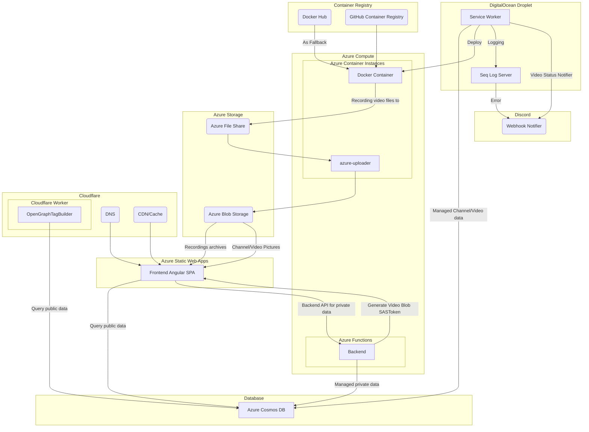

```mermaid
graph TD
subgraph Database
E[Azure Cosmos DB]
end

subgraph Discord
Y(Webhook Notifier)
end
subgraph DigitalOcean Droplet
U[Service Worker]
W[Seq Log Server]
end

subgraph Azure Static Web Apps
A[Frontend Angular SPA]
end

subgraph Azure Compute
subgraph Azure Container Instances
G[Docker Container]
K[azure-uploader]
end

subgraph Azure Functions
C[Backend] 
end
end

subgraph Container Registry
T(Docker Hub)
S(GitHub Container Registry)
end

subgraph Azure Storage
J(Azure File Share)
L(Azure Blob Storage) 
end

subgraph Cloudflare
subgraph Cloudflare Worker
R[OpenGraphTagBuilder]
end
B(DNS)
O(CDN/Cache)
end

C -->|Managed private data| E

O-->A
B-->A

U-->|Managed Channel/Video data|E

A-->|Query public data|E
R-->|Query public data|E

U-->|Deploy|G
T -->|As Fallback|G
S -->G
J --> K-->L

G --> |Recording video files to|J
L-->|Recordings archives|A 
L-->|Channel/Video Pictures|A
A--->|Backend API for private data|C
C-->|Generate Video Blob SASToken|A

U-->|Logging|W

U-->|Video Status Notifier|Y
W-->|Error|Y
```
